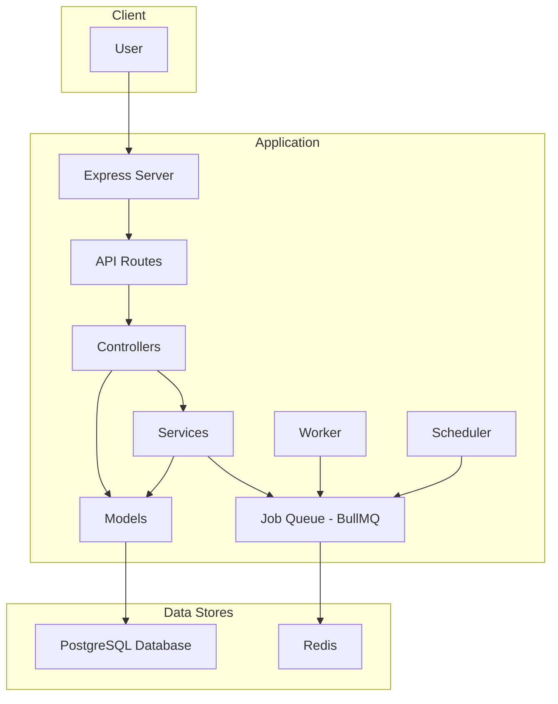
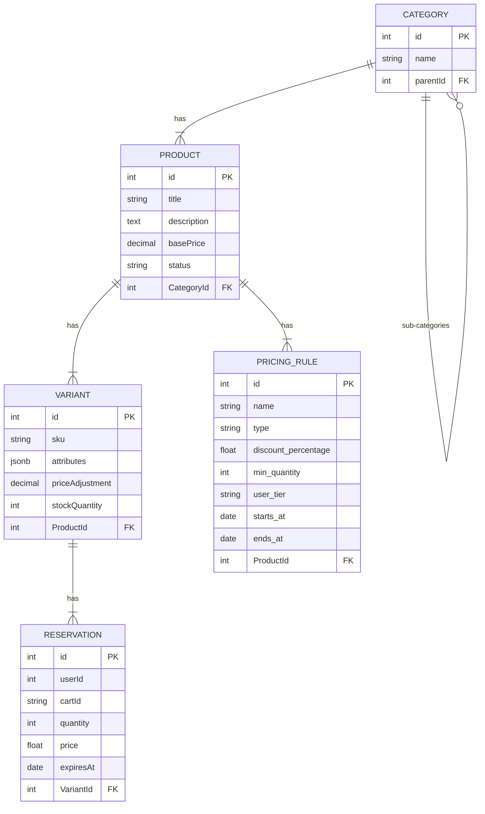

# E-commerce Inventory Management System

## Overview

This is a backend for a robust e-commerce inventory management system. It provides RESTful APIs to manage products, categories, variants, and a shopping cart. It includes a dynamic pricing service and a background job worker to handle inventory reservations and expirations gracefully.

The system is designed to handle concurrent requests, prevent overselling through atomic operations, and provide clear and comprehensive documentation for maintainability and evaluation.

## Table of Contents

-   [Submission Readiness Checklist](#submission-readiness-checklist)
-   [Architecture and Design Decisions](#architecture-and-design-decisions)
-   [Getting Started](#getting-started)
-   [API Documentation](#api-documentation)
-   [Inventory Reservation and Expiration Flow](#inventory-reservation-and-expiration-flow)
-   [Dynamic Pricing Logic](#dynamic-pricing-logic)
-   [Running Tests](#running-tests)

## Submission Readiness Checklist

This project is structured to meet the evaluation criteria:

-   **Functionality and Business Logic:**
    -   [x] All API endpoints are implemented as described in the API Documentation.
    -   [x] The dynamic pricing engine correctly applies sequential discounts.
    -   [x] The inventory system uses database transactions and row-level locking to prevent race conditions and overselling.
    -   [x] The reservation-expiration flow is fully implemented with a background worker that runs periodically.
-   **Code Quality and Architecture:**
    -   [x] The code is organized into layers (controllers, services, models) to separate concerns and improve maintainability.
    -   [x] Critical operations like checkout and reservation are atomic, thanks to database transactions.
-   **Database and Data Modeling:**
    -   [x] The schema correctly models product variants and hierarchical categories.
    -   [x] Indexes are used on foreign keys and frequently queried columns (`expiresAt`, `sku`) to ensure data integrity and performance.
-   **Documentation:**
    -   [x] This `README.md` provides comprehensive documentation covering all required aspects.
    -   [x] Architecture and schema diagrams are included and accurately reflect the implementation.

## Architecture and Design Decisions

### Architecture

The application follows a standard layered architecture:

-   **API (Express.js):** The entry point for all client requests. It handles routing and basic request validation.
-   **Controllers:** Responsible for handling the business logic associated with each API route.
-   **Services:** Encapsulate specific business functionalities like pricing calculations (`PricingService`) and inventory management (`InventoryService`). This promotes separation of concerns and reusability.
-   **Data Access (Sequelize):** The ORM Sequelize is used to interact with the PostgreSQL database, mapping models to tables.
-   **Background Jobs (BullMQ):** A queueing system backed by Redis is used to manage asynchronous tasks, specifically the cleanup of expired inventory reservations. This prevents long-running tasks from blocking the main application thread.

This diagram shows the high-level architecture of the application:



### Key Design Decisions

-   **Atomic Operations for Inventory:** To prevent race conditions and overselling, the `InventoryService` uses database transactions with row-level locks (`SELECT ... FOR UPDATE`) on the `Variant` table during stock reservation. This ensures that checking availability and creating a reservation is an atomic operation.
-   **Temporary Reservations:** Instead of immediately decrementing stock when an item is added to a cart, the system creates a temporary `Reservation` record with a 15-minute expiry. This holds the stock for the user without preventing others from buying it if the user abandons the cart.
-   **Background Worker for Cleanup:** A `BullMQ` worker runs periodically (every minute) to clean up expired `Reservation` records. This is more efficient than checking for expired items on every request and ensures that abandoned stock is reliably released.
-   **Service-Oriented Logic:** Core business logic like pricing and inventory management is abstracted into services. This makes the controllers leaner and the logic easier to test and reuse.

### Database Schema

This diagram illustrates the database schema and the relationships between the tables.


**Note:** The `PRICING_RULE` table is defined in the models, but it is not currently used by the `PricingService`. The pricing rules are hardcoded in the service as a proof-of-concept.

## Getting Started

### Prerequisites

-   [Node.js](https://nodejs.org/) (v14 or higher)
-   [Docker](https://www.docker.com/) and [Docker Compose](https://docs.docker.com/compose/)

### Setup

1.  **Clone the repository:**
    ```bash
    git clone https://github.com/Shanmuka-p/E-commerce_Inventory_23P31A05H8.git
    cd E-commerce_Inventory_23P31A05H8
    ```

2.  **Start Services:**
    Use Docker Compose to start the required services (PostgreSQL and Redis).
    ```bash
    docker-compose up -d
    ```

3.  **Install Dependencies:**
    ```bash
    npm install
    ```

4.  **Environment Variables:**
    Create a `.env` file in the root of the project with the following content:
    ```
    # PostgreSQL settings
    DB_NAME=ecommerce_inventory
    DB_USER=admin
    DB_PASSWORD=password123
    DB_HOST=localhost
    DB_PORT=5432

    # Redis settings
    REDIS_HOST=localhost
    REDIS_PORT=6379
    ```

5.  **Database Setup:**
    The application uses `sequelize.sync()` on startup. This command automatically creates database tables based on the Sequelize models. This is suitable for development, but for a production environment, a more robust migration tool like `sequelize-cli` would be recommended.

6.  **Run the Application:**
    ```bash
    node index.js
    ```
    The server will start on `http://localhost:3000`.

    **Note on Background Worker:** The background worker and scheduler are started automatically when you run the main application (`node index.js`). You do not need to run them as separate processes.

## API Documentation

The base URL for the API is `/api`.

#### Products

| Method | Path | Description | Body / Query Params (Example) |
| :--- | :--- | :--- | :--- |
| `POST` | `/products` | Create a new product. | `{"title": "New Shirt", "basePrice": 25.99, "CategoryId": 1}` |
| `GET` | `/products` | Get all products. | - |
| `GET` | `/products/:id`| Get a product by ID. | - |
| `PUT` | `/products/:id`| Update a product. | `{"basePrice": 29.99}` |
| `DELETE`| `/products/:id`| Delete a product. | - |
| `GET`| `/products/:productId/price` | Calculate price for a product. | *Query:* `?quantity=12&tier=gold` |

#### Categories

| Method | Path | Description | Body (Example) |
| :--- | :--- | :--- | :--- |
| `POST` | `/categories` | Create a new category. | `{"name": "Apparel", "parentId": null}` |
| `GET` | `/categories` | Get all categories. | - |
| `GET` | `/categories/:id`| Get a category by ID. | - |
| `PUT` | `/categories/:id`| Update a category. | `{"name": "Men's Apparel"}` |
| `DELETE`| `/categories/:id`| Delete a category. | - |

#### Variants

| Method | Path | Description | Body (Example) |
| :--- | :--- | :--- | :--- |
| `POST` | `/variants` | Create a new variant. | `{"sku": "SHIRT-BL-L", "attributes": {"color": "blue", "size": "L"}, "stockQuantity": 100, "ProductId": 1}` |
| `GET` | `/variants` | Get all variants. | - |
| `GET` | `/variants/:id`| Get a variant by ID. | - |
| `PUT` | `/variants/:id`| Update a variant. | `{"stockQuantity": 90}` |
| `DELETE`| `/variants/:id`| Delete a variant. | - |

#### Cart

| Method | Path | Description | Body (Example) |
| :--- | :--- | :--- | :--- |
| `POST` | `/cart/add` | Reserve stock for an item. | `{"variantId": 1, "quantity": 2, "userId": 123}` |
| `POST` | `/cart/checkout`| Checkout all reserved items. | `{"userId": 123}` |

## Inventory Reservation and Expiration Flow

This flow ensures that stock is reserved atomically, held for a limited time, and reliably released or consumed.

1.  **Reservation (Adding to Cart):**
    -   A user calls `POST /api/cart/add` with a `variantId` and `quantity`.
    -   The `InventoryService` starts a database transaction and acquires a lock on the specific product variant row.
    -   It calculates the `availableStock` by subtracting the sum of all *active* (non-expired) reservations from the `stockQuantity`.
    -   If there is enough stock, it creates a `Reservation` record with an `expiresAt` timestamp set to 15 minutes in the future.
    -   If stock is insufficient, the transaction is rolled back and an error is returned.

2.  **Expiration (Background Job):**
    -   The `scheduler.js` file adds a cleanup job to the `inventory-cleanup-queue` every minute.
    -   The `cleanupWorker.js` process listens to this queue and deletes all `Reservation` records where `expiresAt` is in the past.
    -   This automatically "releases" the stock for future reservations.

3.  **Checkout:**
    -   A user calls `POST /api/cart/checkout`.
    -   The `InventoryService` finds all active reservations for that user.
    -   In a single transaction, it decrements the `stockQuantity` for each corresponding variant and deletes the reservations. This commits the sale.

## Dynamic Pricing Logic

The dynamic pricing logic is handled by the `PricingService`. The final price of a product variant is calculated by applying a series of rules sequentially.

The following rules are applied in order:

1.  **Base Price:** The calculation starts with the `basePrice` of the product and the `priceAdjustment` of the specific variant.
2.  **Seasonal Discount:** A 10% discount is applied. This is currently always active.
3.  **Bulk Discount:** A 5% discount is applied if the quantity is greater than 10.
4.  **Customer Tier Discount:** A 15% discount is applied for customers with a "gold" tier status.

### Examples

#### Example 1: Standard Customer, Single Item
- **Product Base Price:** 00
- **Variant Adjustment:** +0
- **Quantity:** 1
- **Customer Tier:** standard

**Calculation:**
1.  **Initial Price:** 00 + 0 = 10
2.  **Seasonal Discount (10%):** 10 * 0.10 = 1 discount. Price is now $99.
3.  **Bulk Discount:** Not applicable.
4.  **Customer Tier Discount:** Not applicable.

**Final Unit Price: $99**

#### Example 2: Gold Customer, Bulk Purchase
- **Product Base Price:** 00
- **Variant Adjustment:** +0
- **Quantity:** 15
- **Customer Tier:** gold

**Calculation:**
1.  **Initial Price:** 00 + 0 = 10
2.  **Seasonal Discount (10%):** 10 * 0.10 = 1 discount. Price is now $99.
3.  **Bulk Discount (5%):** $99 * 0.05 = $4.95 discount. Price is now $94.05.
4.  **Customer Tier Discount (15%):** $94.05 * 0.15 = 4.11 discount. Price is now $79.94.

**Final Unit Price: $79.94**
**Total Price: $79.94 * 15 = 199.10**

## Running Tests

To run the test suite, use the following command:

```bash
npm test
```